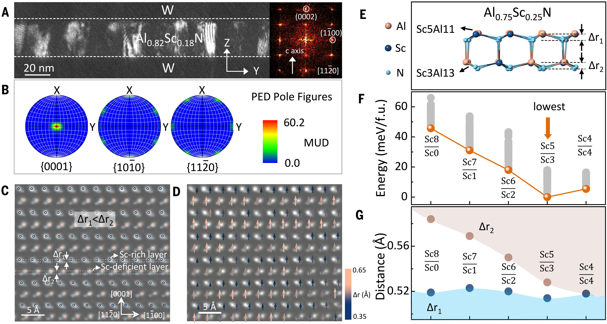
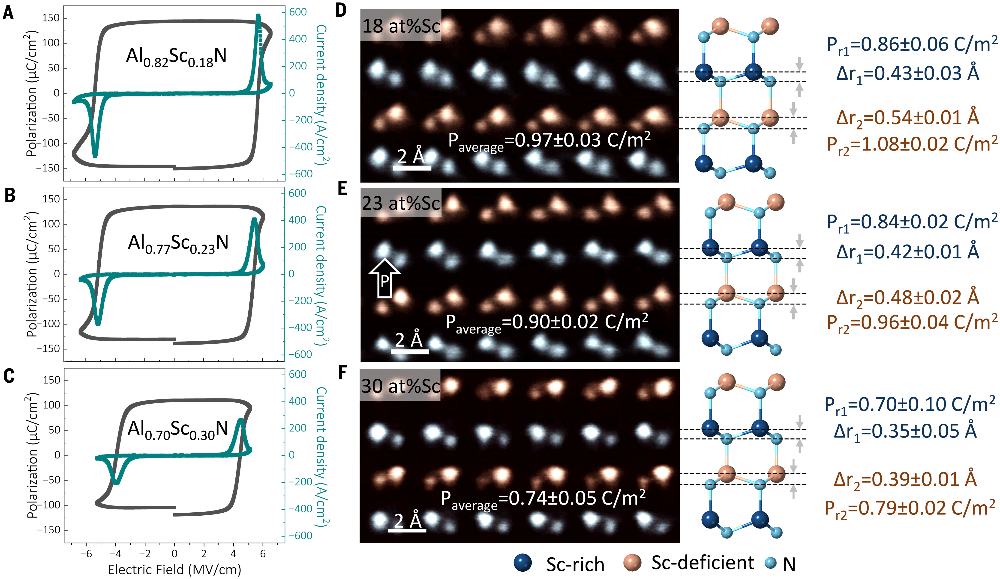
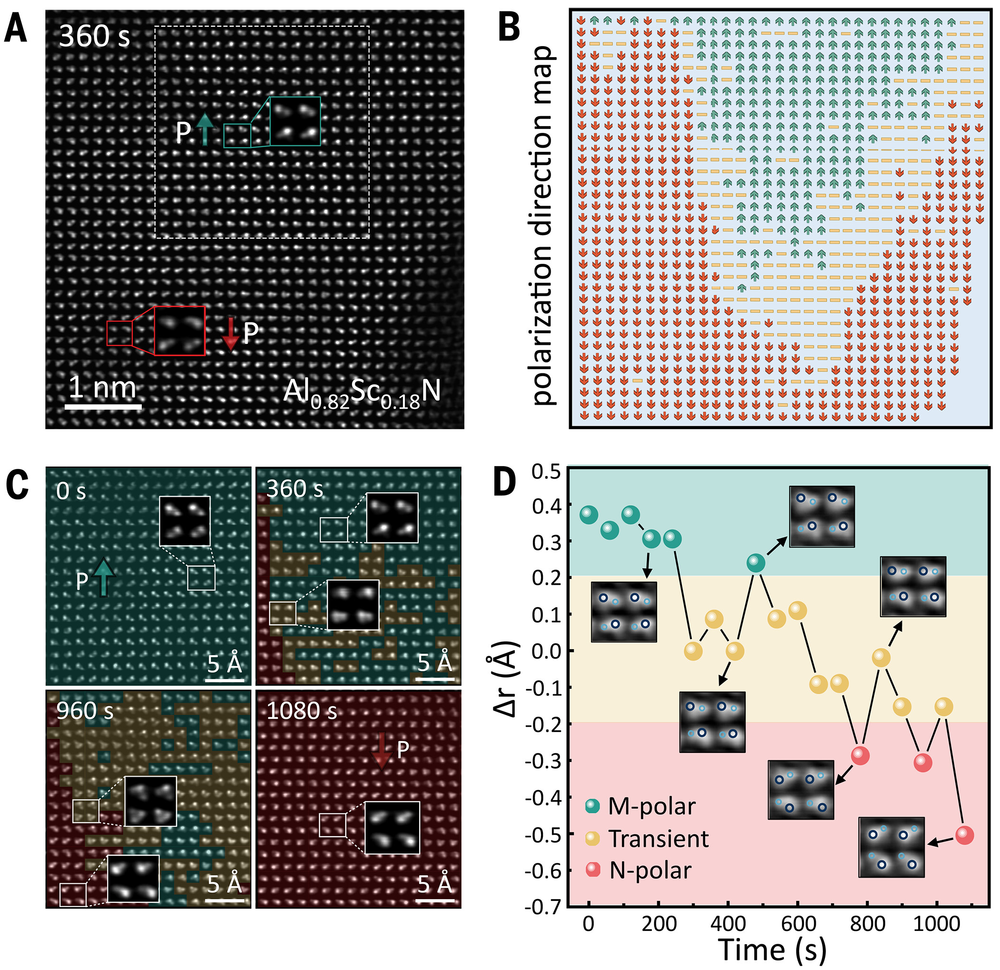
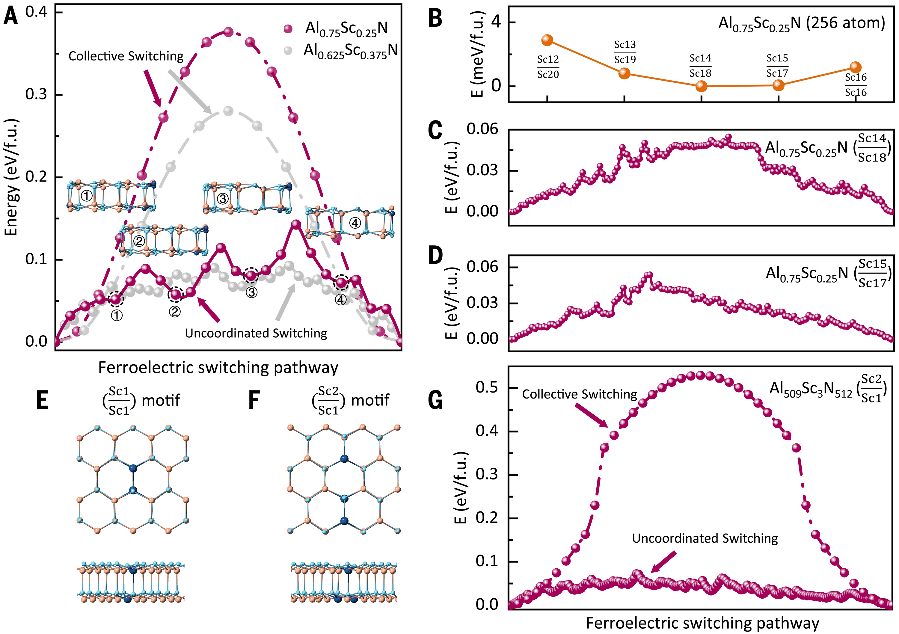

# Science | Al1-xScxN铁电体中交替原子偶极层与极化翻转动力学 | 2026

<small>
论文题目：Alternating atomic-dipole layers and switching dynamics in Al1-xScxN ferroelectrics
第一作者：Yonghui Zheng、Ruirong Bai、Tianjiao Xin、Xuanyu Zhao
通讯作者：Yan Cheng、Yu-Ning Wu、Yingfen Wei
通讯单位：华东师范大学信息与电子工程学院/极化材料与器件教育部重点实验室；复旦大学集成电路与微纳电子创新学院
DOI：https://doi.org/10.1126/science.aee9639
</small>

## 研究背景

**纤锌矿结构 Al1-xScxN 铁电体**因其优异的**极化强度和热稳定性**（工作温度 > 600°C、可开关厚度 ~5 nm），成为下一代非易失性存储器的候选材料。Sc 取代可将**矫顽场降低至击穿场强以下**从而诱导铁电性，但其原子尺度的翻转机制长期缺乏直接实验证据。已有理论提出 Sc 取代引入了非极性六方中间相以实现**集体翻转路径**的能量势垒降低；而在 B 取代 AlN 中则观察到瞬态反极性基元以及畴壁驱动翻转，暗示翻转机制受多种因素交织调控。

本文的核心问题是：**Sc 阳离子取代如何在原子尺度降低极化翻转的能量势垒？** 研究团队采用**球差校正 iDPC-STEM** 成像结合第一性原理计算，在 Al0.82Sc0.18N 薄膜中发现了沿 [0001] 方向**交替排列的原子偶极层**超结构——这一结构源于 Al/Sc 在相邻层间的热力学择优有序化，进而引发了**非集体、分步式极化翻转**，通过多个亚稳中间态将翻转能垒降低约 50%。该工作建立了**原子尺度偶极结构与宏观翻转动力学**之间的直接联系，为纤锌矿铁电体的理性设计提供了新范式。

## 图表解读

### Figure 1. Al0.82Sc0.18N 薄膜中的周期性调制结构

图 1 综合运用了**暗场 TEM、旋进电子衍射（PED）和 iDPC-STEM** 对 Al0.82Sc0.18N 薄膜的微观结构进行表征。暗场像（g = 0002）和快速傅里叶变换证实了**柱状纤锌矿形貌**且 c 轴垂直于基底；PED 极图验证了强烈的 {0001} 织构。iDPC-STEM 沿 [11-20] 带轴成像清晰分辨出两类阳离子层：**一层具有较小的垂直间距 Δr₁，另一层具有较大的 Δr₂**，形成沿 [0001] 方向周期性调制的**偶极超结构**。矢量图定量统计和 EDS 元素分析表明，Δr₁ 较小的层对应较高的 **Sc 浓度**，而 Δr₂ 较大的层对应较低的 Sc 浓度（较高的 Al 含量）。DFT 计算进一步证实，层间 Sc 浓度略微不对称分布（Sc5/Sc3 构型）比对称分布（Sc4/Sc4）能量更低，表明这种**部分有序化**是热力学稳定的。

### Figure 2. Al1-xScxN 薄膜成分可调铁电性的原子尺度起源

图 2 展示了不同 Sc 浓度（x = 0.18、0.23、0.30）下的**电滞回线（P-E）和极化电流密度曲线（J-E）**，以及对应样品的 iDPC-STEM 原子像。随着 Sc 浓度增加，**剩余极化 Pr**（从 ~300 降至 ~220 μC/cm²，降幅 ~27%）和**矫顽场 Ec**（从 5.5 降至 4.2 MV/cm，降幅 ~24%）均呈下降趋势。iDPC-STEM 图像显示，尽管 Sc 浓度不同，相邻层间**交替分布的 Δr 始终存在**，但**平均 Δr 随 Sc 含量增加而减小**。基于 Born 有效电荷近似计算的自发极化从 0.97 ± 0.03 C/m²（x = 0.18）降至 0.74 ± 0.05 C/m²（x = 0.30），与宏观 P-E 测量结果定量一致。该图揭示了**成分-结构-极化性能**之间的关联：Sc 替代整体降低了极化强度，但**层间极化调制的特征持续存在**。

### Figure 3. 极化翻转的时间分辨原子尺度动力学

图 3 展示了利用**原位 iDPC-STEM** 在电子束激发下实时捕捉 Al0.82Sc0.18N 单晶粒中的**极化翻转过程**。图 3A 和 3B 展示了翻转瞬间 M 极性（绿色箭头）和 N 极性（红色箭头）偶极共存的状态，畴壁宽度约为 **0.5–2 nm**。图 3C 展示了从 M 极性起始（0 s），经 360 s 后左侧偶极翻转为 N 极性，同时右侧多个单胞进入**瞬态**（黄色，|Δr| < 0.2 Å，阴阳离子近乎共面）的过程。至 960 s，N 极性区进一步扩展并伴随无序分布的瞬态偶极，最终在 1080 s 完成全部翻转。图 3D 对**单个单胞**的连续追踪显示，偶极在 M 极性、N 极性和瞬态之间**反复非单调振荡**，最终稳定在 N 极性，揭示出一种**混沌、非集体的分步翻转**行为，仅 ~18 at% Sc 即可实现此前理论预测需 ~36 at% Sc 的离散翻转。

### Figure 4. AlScN 中极化翻转的原子尺度能量景观与成分效应

图 4 结合 DFT 和大规模神经网络势（NNP）计算，揭示了翻转能垒降低的原子尺度机制。图 4A 对比了 Al0.75Sc0.25N 的**集体翻转路径**（能垒 0.38 eV/f.u.）与**非协调翻转路径**（4 个瞬态，能垒仅 0.14 eV/f.u.，降低约 63%），更高 Sc 浓度（37.5%）下能垒进一步降至 0.09 eV/f.u.。图 4B-D 展示 NNP 高通量计算（256 原子超胞，40,000 构型采样）证实：**不均匀的 Sc 层间分布**能量更低，非协调翻转能垒约 0.05 eV/f.u.（~2.34 meV/ų），与已报道实验值一致。图 4E-G 的关键发现是：在低 Sc 浓度稀释极限下，只有当 **Sc 原子形成团簇**（clustered Sc2/Sc1 基元）时，翻转才从集体模式转变为非协调模式（能垒 ~0.07 eV/f.u.），证明了**Sc 团簇打破结构对称性、引入局域能谷**，是实现分步低能垒翻转的关键。

## 实验样品制备方法

**①薄膜沉积：**以 **W/Al0.82Sc0.18N/W 电容器堆栈**形式，通过**室温反应共溅射**在真空环境中依次沉积底电极 W、AlScN 铁电层和顶电极 W，全程不破真空。
**②成分调控：**通过调节溅射过程中 Al 和 Sc 靶的功率比，制备不同 Sc 浓度（x = 0.18、0.23、0.30）的 Al1-xScxN 薄膜。
**③截面 TEM 样品制备：**采用聚焦离子束（FIB）技术制备截面 TEM 样品（文中未详细说明 FIB 具体参数），用于 STEM 成像和原位实验。观察方向为 [11-20] 带轴。
**④原位电镜表征：**利用球差校正 TEM 中的电子束既作为成像探针又作为激发源，通过束-固相互作用产生局域横向电场（估算量级为 MV/cm），在原位条件下通过 iDPC-STEM 采集 Al0.82Sc0.18N 单晶粒在不同辐照时间下的原子像。
**⑤第一性原理计算：**采用 DFT（VASP）和 NNP 方法构建 64–1024 原子超胞，计算不同 Sc 层间分布构型的形成能和翻转路径能垒。

## 知识拓展：创新点分析

本文的核心创新在于**首次从原子尺度实验揭示了一种全新的极化翻转机制**。在材料设计层面，论文发现室温溅射的 Al1-xScxN 薄膜中 Sc 原子并非随机分布，而是自发形成**层间 Sc 浓度呈周期性调制的交替偶极层**结构——这是一种动力学亚稳态下的**自组织化学有序化**，区别于高温退火（>1200°C）下的热力学平衡态层状相。在表征方法层面，利用 iDPC-STEM 对轻元素的高灵敏度，实现了**阴阳离子垂直间距（Δr）的精确定量**，直接可视化了亚晶格尺度的极化调制，并借助原位电子束激发**实时捕捉到单个单胞偶极的反复振荡和非集体分步翻转**。理论计算层面，揭示了 Sc 团簇打破局域对称性、引入**多个亚稳中间态以分段降低能垒**的物理图像，将翻转能垒降低约 50%–67%，与宏观电学测试（成核限制→畴壁运动的翻转动力学转变）和原位观察形成闭环证据链。该工作为通过**阳离子取代的离子半径、价态和浓度工程**来设计低翻转势垒的纤锌矿铁电体提供了清晰的原子机制指导。

## 一句话总结

本文通过**球差校正 iDPC-STEM 原位成像与第一性原理计算**，在 Al1-xScxN 铁电体中发现了由**Al/Sc 层间化学有序化**驱动的交替原子偶极层超结构，直接观察到**非集体、分步式极化翻转**动力学过程，揭示了 Sc 团簇通过引入多个亚稳中间态将翻转能垒降低约 50% 的微观机制。
